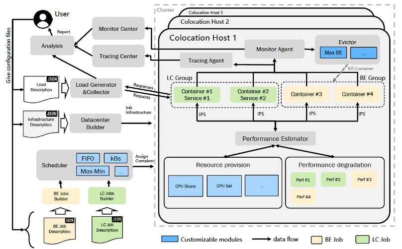
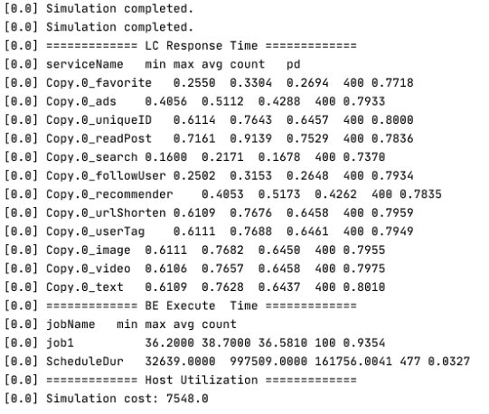

# ColocationSim

##Introduction
将在线作业和离线作业混合部署在同一集群（简称混部，Colocation）提升数据中心资源利用率的主流方法，如何在保证在线作业性能的前提下最大化集群的资源利用率成为混部相关研究中最主要问题。混部作业调度算法从集群层面解决这一问题，是学术界、企业界的研究热点。
验证混部作业调度算法的效果是研究中的一个重要步骤，在大规模集群中验证新的调度算法存在成本高、风险大、验证周期长等问题，并且大规模验证对于学术研究机构往往不现实。目前亟需面向在离线混部的调度模拟器，通过软件模拟的方法快速验证新的调度算法的效果。

因此，我们研发了面向在离线混部的调度模拟器ColocationSim，ColocationSim是在经典的云计算调度模拟器CloudSim上新增了针对作业间性能干扰的模拟，同时ColocationSim还支持了目前常见的在离线作业形式，如微服务形式的在线作业，Graph-Based离线作业，用户可通过简单的json配置文件完成在离线作业的构造和作业负载的定义。
用户在ColocationSim中实现新的调度算法，模拟开始后，ColocationSim根据作业描述文件生成并提交对应的作业到调度器，调度器调用新的调度算法进行调度，待所有作业完成后ColocationSim会给出在线作业SLA违反率、资源利用率、资源碎片、离线作业吞吐率等用于评价在离线混部作业调度算法的指标。

Colocationsim架构

##支持功能 Supported Features

### 在线作业模拟方面：
- 任意拓扑的微服务作业
- request的模拟，用户自定义request处理逻辑，：
- request在service之间的转发；
- 用户自定义的负载模式

### 离线作业模拟方面：
DAG结构的离线作业

### 干扰模拟方面：
支持用户自定义干扰模式，在线在线、在线离线，离线离线间的相互干扰

##关键概念 Key Concepts
**在线作业**：一组long running services，经调度运行后不退出，等待用户（模拟的用户）的请求

**离线作业**：一个离线作业对应一个Job，每个Job包含多个Task，多个Task的执行顺序由一个DAG描述。

**Local、remote编程元语**：ColocationSim中使用两种编程元语构造作业执行逻辑，local元语和remote元语，local（N）代表本地处理N条指令，remote（A）代表远程调用A服务，使用两个编程元语可构造任意调用拓扑、任意执行复杂度的在线作业。Task的执行逻辑中仅有local元语

**干扰值**：离线作业Task和在线作业Service的一个属性，为一个浮点型数字，用于描述一个作业对于其他作业的干扰，可由用户指定，也可使用文献Bubble-Up中的reporter测量。目前ColocationSim采用内存带宽作为干扰值，其定义见离线文件task中的memBW属性。

**敏感函数**：用于描述个作业的性能和干扰值之间的对应关系，记为f（x），代表作业在干扰值为x时的性能。其性能决定了其local元语的执行速度。敏感函数的定义见作业配置文件中的sensitiveFunctions

## 使用方法
1.	将项目导入IDE中，本项目由纯java开发，依赖由maven管理，无需人工安装额外的程序库和依赖包
2.	编写混部作业调度算法，新的调度算法需继承`package org.workflowsim.scheduling. BaseSchedulingAlgorithm`，可参考`package org.colocation.scheduler`下的调度算法实现
3.	定制在离线作业和作业负载。在线作业负载可参考`modules\cloudsim-examples\src\main\java\org\cloudbus\cloudsim\examples\colocation\socialnetwork.json`，该文件给出了socailnetwork的描述，包含了30个微服务，离线作业负载可参考文`modules\cloudsim-examples\src\main\java\org\cloudbus\cloudsim\examples\colocation\beJobs-sf-mbw.json`
4.	运行示例程序`org.cloudbus.cloudsim.examples.colocation. ICWSSocialNetworkLcEvaluation`,该类模拟了social network服务和离线作业的混部调度。请注意需要配置输出文件夹`outputPath = "/path/to/your/sim-out"`; 并保障该文件夹已经被创建。
5.	等待模拟结束后，控制台会输出简要的报告，如：

